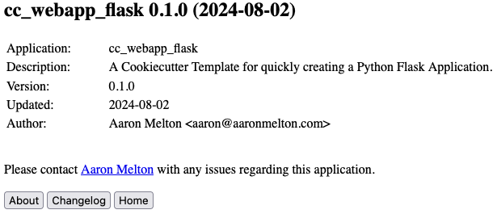

# Cookiecutter Template for Python Flask Applications

A Cookiecutter Template for quickly creating a Python Flask Application.

## Getting Started

### About This Code

This Cookiecutter Template was created to accelerate the creation of new Python
code repositories that contain all the basic files and functionality required
to begin a working Python project.

Includes:
* CHANGELOG.md from [keep a changelog](https://keepachangelog.com/en/1.1.0/)
* CODEOWNERS file for working with GitHub or GitLab
* Docker files for working with `docker` or `docker-compose`
* LICENSE: Replace with your own from [choosealicense.com](https://choosealicense.com)
* pyproject.toml for working with Python Poetry

Code generated by this boilerplate is designed to pass Python PEP, linting and
security checks using my [run_code_checks.sh](https://gist.github.com/aaronmelton/385b69524588facbc948742d7f22c8fc) shell script.

### Requirements

* [cookiecutter Python package](https://github.com/cookiecutter/cookiecutter)
* [poetry](https://python-poetry.org/) for package management
* [aaron_common_libs](https://github.com/aaronmelton/aaron-common-libs) for various common classes used in my scripts.

### Instructions For Use

#### Installation

1. Use Cookiecutter to create a new Python project: `cookiecutter https://github.com/aaronmelton/cc-webapp-flask`
2. Answer the questions as prompted by Cookiecutter.  Answers to these questions are used as variables to populate various project files.
* `author_name`: Your name (required)
* `author_email`: Your Email address (required)
* `author`: Automatically generated from `author_name` and `author_email` (can override)
* `project_name`: Name of project (required)
* `project_date`: ISO-8601 date format like all good nerds should use (required)
* `project_slug`: Automatically generated from `project_name` (can override)
* `project_description`: (optional)
* `project_directory`: Automatically generated from `project_name` (can override)
* `project_url`: URL of the git repository for this script (optional, assuming you will use one).
* `version`: Version number using [Semantic Versioning](https://semver.org) format.
* `git_username`: Your GitHub or GitLab username with `@` as part of the prefix.
* `python_version`: Python version (recommend using version presented in the script)
* `use_rich_console`: Answer `yes` if you wish to use the [rich](https://github.com/Textualize/rich) library for cool terminal formatting (optional).
* `generate_docker_files`: Answer `no` if you wish to have them removed.
3. Follow the suggested commands (`poetry shell` and `poetry update`) to initialize the project.
4. Use my [run_code_checks.sh](https://gist.github.com/aaronmelton/385b69524588facbc948742d7f22c8fc) script and address any findings (if you care about that sort of thing).

#### Python Commands

`flask run` to start the Flask app in interactive mode.

## Authors
* **Aaron Melton** - *Author* - Aaron Melton <aaron@aaronmelton.com>